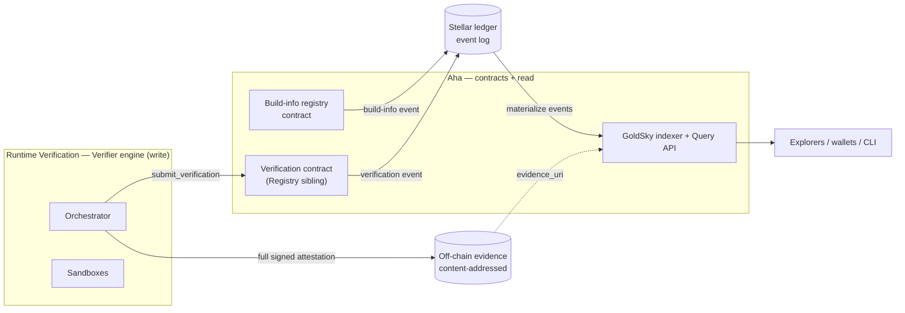
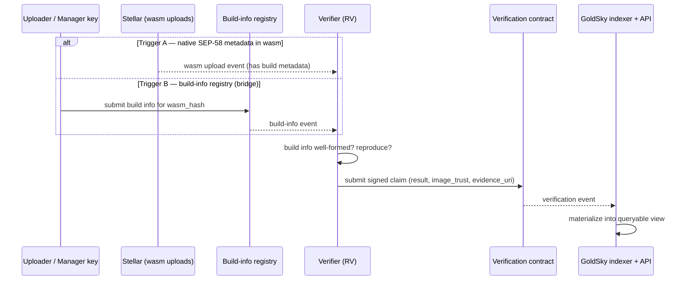
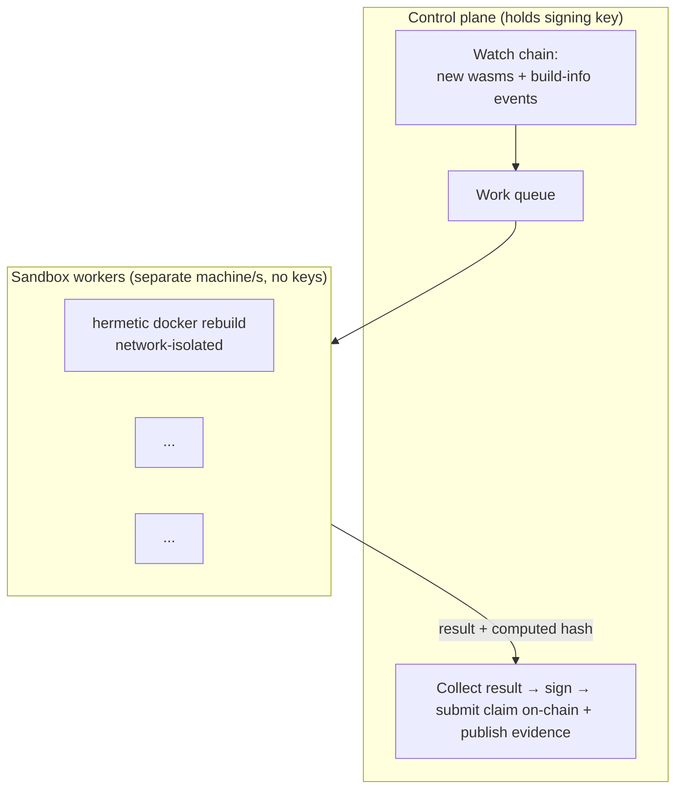
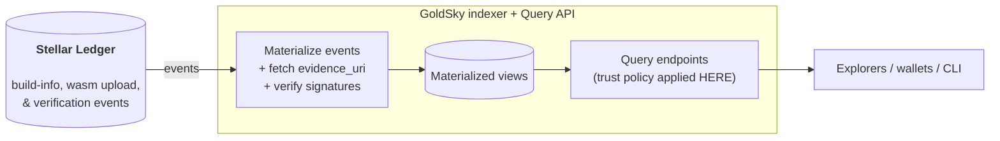

# Verified Stellar Sources — Technical Architecture (High Level)

**Purpose:** a shared reference for the three-party build — Ethan Frey (technical lead / architect), Runtime Verification (verification engine), and The Aha Company (contracts + indexed query API). This describes the *boundary and shape* the parties can agree on, not the full spec; the detailed design follows in the architecture documents (Milestone 1).

---

## 1. The design: event-sourced verification

The whole architecture is one idea applied consistently: **the chain carries verification *events*, and every queryable view is materialized from them.**

A verification is an *event* — a signed, independently re-checkable claim ("verifier V rebuilt source S in image I and got hash H"), submitted as a transaction. The chain is not used as a store of mutable state; it is the ordered, tamper-evident log of what was claimed and when. Re-verifying a contract later, or a second verifier disagreeing, is simply another event. That cleanly splits the system into a write side and a read side:

- **Write side — produce.** Verifiers rebuild contracts and append signed claims to the log (§4).
- **Read side — materialize & serve.** An indexer (GoldSky) consumes the event stream and materializes it into queryable views served behind an API (§5).

Because every reader materializes the same base facts from the same chain, **there is no privileged server.** The chain is the single source of truth for *events*; the queryable state is derived and replaceable. The reference query service is one materialization; others can be built.

**Why the chain as the event bus — not pure P2P off-chain?** A gossip network would force operators to trust each other's ordering and completeness (an operator could silently drop or reorder claims), which means building hash-chained logs, cursors, equivocation detection, and cycle handling — a whole distributed-systems subsystem to write and audit. The ledger already provides global ordering, tamper-evidence, and non-equivocation for free. Using it as the event bus deletes that subsystem entirely.

**Why materialize off-chain — not just on-chain RPC queries?** On-chain storage is a poor query surface: RPC gives point lookups, not the filtering, ranking, history, and cross-contract joins consumers actually need ("unverified contracts above X activity," "all mismatches," "results by image-trust level"). It's slow under load, and Soroban persistent storage carries TTL/rent, so it can't be the durable analytic store. Forcing every explorer and wallet to RPC the contracts per query is exactly the "every consumer rebuilds / one hardcoded verifier" outcome the RFP rules out. So: **chain for the event truth and ordering; a materialized index for speed and power.**

**Where trust lives.** What counts as "verified" is decided at the **read layer** — not by the verifier, not by the contracts. Verifiers only produce re-checkable signed claims; the contracts only record events behind an anti-spam auth gate. The query layer applies a trust policy over the same facts, so one dataset can power a strict explorer badge and a permissive developer view at once, with no change upstream (§5–6).

---

## 2. Ownership boundary

The system has a single clean seam: **the on-chain contracts.** Everything that *produces* a result is the verifier side; the contracts and everything that *serves* results is the read side. Three parties, three areas of ownership.

| Area | Owner | Responsibility |
| --- | --- | --- |
| **Architecture & SEP process** | **Ethan Frey** | Technical lead and architect: system design and review, the interoperability spec between parties, and driving the **SEP proposal process** (SEP-58 and the forthcoming verifier-API SEP) with SDF and the community |
| **Existing-contract recovery** | **Ethan Frey** | Recovering build metadata for old contracts that predate the standard, and the processes around rediscovering and re-submitting it |
| **Verifier engine** | **Runtime Verification** | Hermetic rebuild, byte-compare, sign, and submit the claim on-chain; publish off-chain evidence; operate an independent verifier |
| **On-chain contracts** | **The Aha Company** | The build-info registry and the verification contract (Registry-family siblings); **authorization/governance for who may write to each**; event emission |
| **Indexer + Query API** | **The Aha Company** | GoldSky materialization of chain events; the query API consumers use; trust policy applied at the endpoint |

The parties build to the contract interfaces and can develop independently against them. The contracts are the API between the halves — so the items to lock early are the write shapes, the **event schemas**, and the off-chain evidence format (these are the Milestone 1 deliverables).

---

## 3. The on-chain surface (event-first)

Consumers never query the chain directly at scale; everything is materialized from events. There is one contract that **records verification claims**, and there are **two ways a verification run gets triggered**.

### Two triggers for a verification run

**Trigger A — native SEP-58 metadata in the wasm (the end state).** Any wasm uploaded to the network is checked. If it already embeds sufficient SEP-58 build metadata (`bldimg`, `bldopt`, source identifiers), that upload itself is enough: verifiers pick it up directly from the wasm and run verification immediately, with **no registry contract involved**. This is the steady-state path — a wasm that ships with proper metadata is verifiable the moment it lands.

**Trigger B — build-info registry (the bridge from today).** Many already-deployed wasms carry no metadata, and not every future upload will embed it. The build-info registry covers them. Keyed by `wasm_hash`, it lets build info be submitted for a wasm that lacks it on-chain. Writing it **emits a build-info event** verifiers pick up, exactly as native metadata would. For **existing contracts** that predate the standard, build info is recovered off-chain and written here by an **authorized manager key** — the original wasm uploader or an Aha-governed manager, *not* anyone, so the registry can't be spammed with junk build info. This contract is the bridge between the current state (most contracts unverifiable) and the end state (metadata native in the wasm).

Either trigger leads to the same downstream flow.

### The verification contract

Holds the signed claims. A verifier that has reproduced a `wasm_hash` submits `(wasm_hash, verifier, result, image_trust, evidence_uri, timestamp)`. Writing it **emits a verification event** that the indexer materializes and the API surfaces.

Authorization — who may register build info, who may submit claims, manager-key governance — is owned by Aha. The claim shape and event schemas are fixed in Milestone 1 so all parties build against a stable interface.

---

## 4. Verifier engine (write side — Runtime Verification)

A **control plane** plus **disposable sandbox workers**, deliberately separated across machines.

Key design choices:

- **Sandboxes run on a different machine from the control plane.** The worker executes untrusted build logic (a contract's `build.rs` can do anything), so it must be isolated from the host and, critically, from the signing key. The worker returns only a result and a computed hash; it can never sign or submit. Hermetic, network-isolated rebuild is the defense against build-time exfiltration — not source scanning.
- **Elastic in the bootstrap phase.** During the initial back-verification crunch the engine fans out to many ephemeral workers to attempt thousands of candidate blobs (and, for metadata-absent blobs, multiple `version × flag × arch` combinations) in parallel. This is where most of the day-one coverage is produced.
- **Down to one isolated worker in steady state.** Once the corpus is processed, ongoing verification of new deployments needs only a single isolated worker. An operator who wants lower ops overhead can run the worker on the same machine as the control plane — an explicit security-for-simplicity tradeoff, not a default.
- **Image trust as a gradient.** The engine records `arbitrary → auditable → sdf_trusted` rather than a binary, anchored on the SDF-allowlisted trusted images.
- **All SEP-58 source modes**, with IPFS retrieval as a first-tier channel alongside HTTPS and content-addressed (`tarball_sha256`-only) builds.

---

## 5. Indexer + Query API (read side — Aha, via GoldSky)

The read side materializes chain events into queryable views. The reference implementation uses **GoldSky** as the materializer; because the views are derived from the event log, the materialization layer is replaceable without touching the contracts or the verifier.

**How it gets data.** GoldSky subscribes to the build-info and verification events emitted by the two contracts, as well as all wasm uploads with `img`/`src` info, and materializes it all into query-optimized views. For each verification event the pipeline can fetch the off-chain evidence by `evidence_uri` and verify the verifier signature. Because the source of truth is the event log, a view can be rebuilt by replaying history — there is no fragile mutable state to corrupt.

**How it serves data.** Rich endpoints over the materialized views, shaped to conform to the forthcoming verifier-API SEP:

- lookup by `contract_id` or `wasm_hash` → verification status, recorded SEP-58 fields, build metadata, image-trust signal, per-verifier history, and surfaced disagreement;
- list / filter / rank queries that on-chain RPC cannot serve — unverified-but-high-activity contracts, all mismatches, results filtered by image-trust level, history over time.

**Variable trust at the endpoint.** Trust policy is a gradient, not a binary, which is tunable *here*, by consumers at query time. Never upstream. A request can specify its trust parameters in multiple ways:

 - **Trust Set**:  specific verifier keys it honors ("all contracts trusted by Runtime Verification")
 - **Named Policy**: `sdf_trusted`, say, to return all wasms/contracts trusted by SDF
 
The API returns results that match that policy and surfaces divergence rather than collapsing it. Different endpoints can apply different rules to the same underlying facts.

**Future work — alternative materializers.** The reference path is GoldSky. Because everything downstream is derived from chain events, an independent party could materialize the same events into a self-hosted store (e.g. a SQLite materializer) and serve the same API. This is proposed as future work to pursue if there is demand for fully self-hosted, GoldSky-independent query nodes; it is not required for launch.

---

## 6. Trust, end to end

Three distinct decisions, each made in exactly one place — none of them in the verifier or "in the contracts" as a verdict:

- **Write admission (anti-spam) — at the contracts.** Authorization gates who may register build info and who may submit claims, governed by Aha. This is a spam/DoS floor, *not* a claim that an authorized verifier is correct.
- **What "verified" means — at the read layer.** Consumers pick a trust set of verifier keys at the API endpoint. Sybil-resistance is by curation, not by counting.
- **Disagreement — surfaced, never resolved.** Two claims on one `wasm_hash` with different results are shown per-verifier (`[✓] X`, `[!] Y`), with a summary for the common all-agree case. No staking, no slashing, no consensus — integrity comes from reproducibility, and any claim can be independently re-run.

---

## 7. Back-verification & corpus (the differentiator)

Verifying fresh, SEP-58-complete contracts is the bare minimum. What really differentiates this proposal is the effort into verifying the **existing deployed corpus**, most of which predates the standard. Because results key on `wasm_hash`, a small number of high-impact blobs cover a large share of activity.

**Findings from mainnet deployment analysis.** The distribution is extremely concentrated, which is exactly what makes `wasm_hash`-keying powerful:

- **100k+ active contracts** on Soroban mainnet.
- **~70% resolve to a single wasm hash** — the rain-crossmint smart-account/factory implementation. Reproducing that **one blob** covers ~70% of all active contracts in a single verification.
- The remaining ~30% map to **~3,600 distinct wasm hashes**.
- Of those 3,600, **970** carry both a `cliver` and a stable `rsver`, making them directly reproducible *if the source can be located*.

So the corpus is really "one dominant blob + a few thousand long-tail hashes," not 100k independent problems — a handful of rebuilds reaches majority coverage on day one.

**Activity-weighted ranking.** Before we try to dig through all 970 contracts, we will map on-chain *activity* of contracts to wasm hashes, so blobs are prioritized by real usage rather than raw count. A hash with heavy transaction volume matters more than a rarely used one. This ranking drives both the back-verification work order and the headline figure below.

These feed the headline launch figure — **"verified [X]% of deployed contracts and [Y]% of on-chain activity at launch"** — finalized once the corpus pass and activity ranking complete. Schedule buffer belongs here, since the metadata-absent long tail is the one open-ended slice. Recovering build metadata for these existing contracts is Ethan's workstream. This analysis work has already started, but the deliverable will only be required for milestone 4 as it is the most open-ended research segment rather than pure engineering.

---

## 8. Milestones

Each milestone has a single lead responsible for driving it; the other parties contribute, but ownership is unambiguous.

**Milestone 1 — Architecture & specs (lead: Ethan).** Architecture documents, SEP proposals (SEP-58 and the verifier-API SEP), and the high-level interoperability specification defining the formats and interfaces between the three parties. At least a spec the others can build against, evolved further with their feedback.

**Milestone 2 — Verification engine (lead: Runtime Verification).** RV implements the verification side: the hermetic rebuild engine, signing, and claim submission, tested end-to-end. Aha provides **stub contracts** for the build-info trigger and claim write path (minimal — just enough to exercise the flow). Ethan guides the design where needed.

**Milestone 3 — Contracts, indexer & query engine (lead: Aha).** Finalize the two contracts, build the GoldSky indexer and the query API. In parallel, ongoing recovery of existing contracts' build metadata and verification of the flow at scale.

**Milestone 4 — Integrate & launch on mainnet (all three parties).** Connect every component end-to-end and launch on mainnet — the final goal. A significant corpus of existing contracts is recovered and uploaded; SEPs, RFCs, and the API spec are settled; protocols finalized. This milestone is shared: by this point the parties have built the trust and experience to deliver it together.

---

## 9. Explicitly out of scope

Producing the trusted Docker images (the verifier consumes SDF's); authoring SEP-55 (coordinate, not author); deterministic-Rust compilation as research (use best-available, anchored on trusted images); explorer UI work; republishing artifacts to IPFS (consume IPFS source and content-address it, no operated storage).

---

## 10. To agree on (Milestone 1 detail)

1. **Contract write interfaces** — the build-info submission shape and the `submit_verification` shape, including the `result` / `image_trust` enums.
2. **Event schemas** — the fields each event carries, so any materializer can derive the full view from chain history alone.
3. **Off-chain evidence format** — schema and content-addressing scheme behind `evidence_uri`.
4. **Authorization model** — who may register build info, who may submit claims, and the manager-key governance for recovering existing contracts.
5. **Query API trust surface** — named policies vs. a `trust_set` parameter, and the default policy for an un-parameterized request.
6. **Sequencing** — aligning the corpus-recovery work and contract-live dates against Aha's Registry mainnet timeline.
